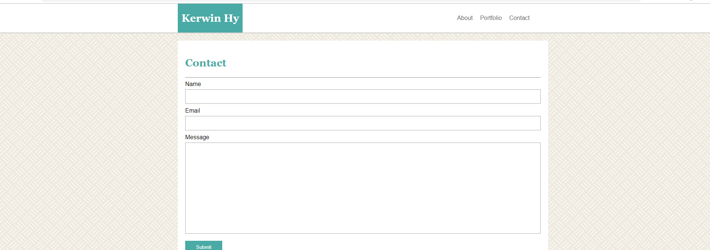

# Basic Portfolio: Recommended Homework Assignment

## Site Picture




## Technologies Used
- HTML
- CSS
- Git
- GitHub
- VSCode

## Summary
Basic Portfolio that contains 3 pages. Header and footer remains consistent throughout the pages and the main content body changes as the user changes pages. Utilized floats in this layout for styling navbar and text-wrapping around the photo.

## Links
Live Page: [https://seiretsym.github.io/basic-portfolio](https://seiretsym.github.io/basic-portfolio)<br>
Repo: [https://github.com/seiretsym/basic-portfolio](https://github.com/seiretsym/basic-portfolio)

## Code Snippet
```
index.html
    <body>
        <!-- header element that contains the nav bar and logo -->
        <header>
            <!-- container for logo and links -->
            <div class="container">
                <nav>
                    <a href="index.html" id="name"><h1>Kerwin Hy</h1></a>
                    <a href="contact.html" id="nav">Contact</a>
                    <a href="portfolio.html" id="nav">Portfolio</a>
                    <a href="index.html" id="nav">About</a>
                </nav>
            </div>
        </header>

        <!-- container for main content -->
        <div class="container">
            <section id="content">
                <h2>About Me</h2>
                <hr>
                
                <p>
                    Lorem ipsum dolor sit amet consectetur adipisicing elit...
                </p>
            </section>
        </div>
        <footer>
            Copyright &copy
        </footer>
    </body>
```